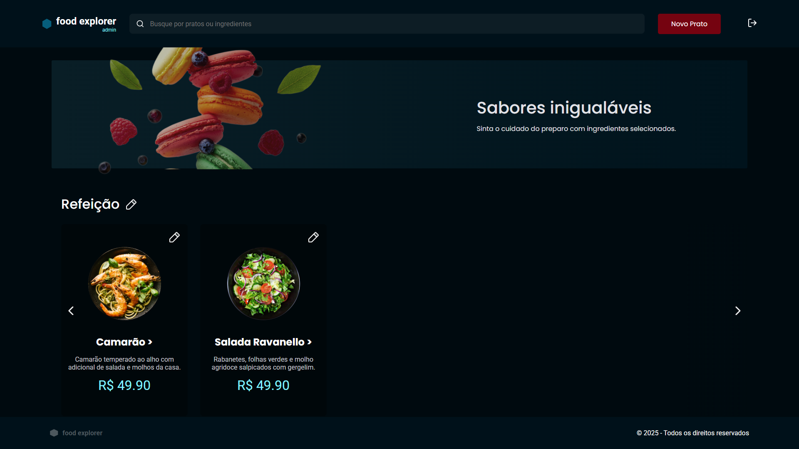

# Food Explorer - A restaurant system solution


A modern React application built with Javascript, React, Vite and Styled Components.

## 🚀 Features

- ⚡️ Lightning-fast development with Vite
- 🎨 Styled Components CSS for styling
- 📱 Fully responsive design

## 📖 Description

This is a frontend application for a restaurant, where users can explore available dishes and manage the menu. There are two types of users: Admin and Customer.

- Admin users can add, edit, and delete dishes and dish categories.
- All users can view all available dishes and search for them by name or ingredients.
  
The application includes a Home page displaying all dishes and a Details page where users can view detailed information about a specific dish. For admin users, the add and edit a dish pages are also available.

## 📦 Prerequisites

- Node.js (version 18 or higher)
- npm or yarn

## 🛠️ Installation

1. Clone the repository:
```bash
git clone https://github.com/LipeMT/food-explorer-front-end.git
```

2. Navigate to the project directory:
```bash
cd food-explorer-front-end
```

3. Install dependencies:
```bash
npm install
```

## 🚀 Development

Start the development server:

```bash
npm run dev
```

The application will be available at `http://localhost:5173`

## 🏗️ Building for Production

Create a production build:

```bash
npm run build
```

Preview the production build:

```bash
npm run preview
```

## 🧰 Tech Stack

- [React](https://reactjs.org/)
- [Javascript](https://developer.mozilla.org/en-US/docs/Web/JavaScript)
- [Vite](https://vitejs.dev/)
- [Styled Components](https://styled-components.com/)

## 📝 Project Structure

```
/
├── src/
│   ├── assets/        # Static assets and resources
│   ├── components/    # Reusable React components
│   ├── hooks/         # Custom React hooks
│   ├── pages/         # Page components
│   ├── routes/        # Route configurations
│   ├── services/      # API services and utilities
│   ├── styles/        # Global styles and Tailwind config
│   ├── App.tsx        # Main application component
│   └── main.tsx       # Application entry point
├── public/            # Static public assets
└── config files       # Various configuration files
```

## 💻 Deploy

To deploy this project, run:

```bash
  npm run deploy
```

## 📄 License

This project is licensed under the MIT License - see the [LICENSE](LICENSE) file for details.

## 👥 Contributing

1. Fork the repository
2. Create your feature branch (`git checkout -b feature/amazing-feature`)
3. Commit your changes (`git commit -m 'Add some amazing feature'`)
4. Push to the branch (`git push origin feature/amazing-feature`)
5. Open a Pull Request

## 📞 Contact

Your Name - Luís Felipe Marques Tomé

LinkedIn: [https://www.linkedin.com/in/luisfelipemarquestome/](https://www.linkedin.com/in/luisfelipemarquestome/)

Project Link: [https://github.com/LipeMT/food-explorer-front-end.git](https://github.com/LipeMT/food-explorer-front-end.git)

Project Deploy:  [https://lipemt.github.io/food-explorer-front-end/](https://lipemt.github.io/food-explorer-front-end/)